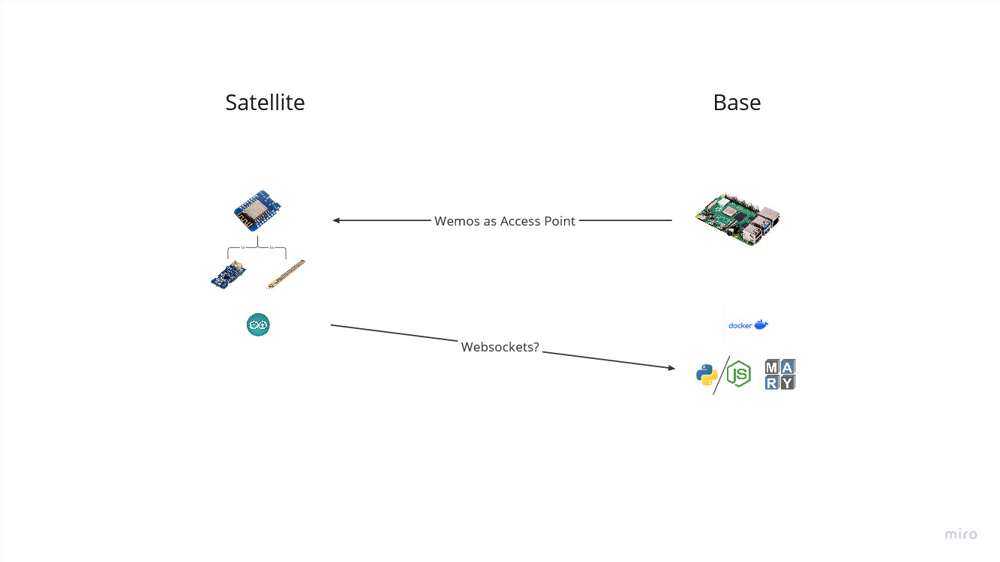

# ConvoGauntlet

## Miro

Link to our [Miro-Board](https://miro.com/app/board/uXjVNS7nv_c=/).

## Concept

[//]: # (TODO write a Concept)




## Installation

### Linux (tested on Raspbian and Arch)

Move to ```ConvoGauntlet``` directory.  
Get a list of your connected sound cards:

```shell
cat /proc/asound/cards
```

Edit ```./asound.conf``` and change the number according to your preferred card: 

```text
defaults.pcm.card 1
defaults.ctl.card 1
```

Start the service by running the following command:

```shell
docker-compose up --build -d
```
(You may have to run this command with ```root``` privileges.)
